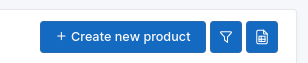
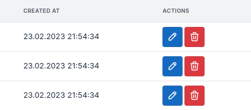

# Adding actions

What is a list of products without the ability of creating and editing the records?
In this bundle, there are two kinds of actions:

* [global action](#adding-global-actions), displayed above the data table - e.g. "Create new user";
* [row action](#adding-row-actions), displayed on each row, e.g. "Edit", "Delete";

Similar to data tables, columns and filters, actions are defined using the [type classes](../features/type-classes.md).

## Adding global actions

--

Let's assume that the application has an `app_product_create` route for creating new products.\
The user should be able to click a "Create new product" button above the data table.

To add global action, use the builder's `addAction()` method:

```php # src/DataTable/Type/ProductDataTableType.php
use Kreyu\Bundle\DataTableBundle\DataTableBuilderInterface;
use Kreyu\Bundle\DataTableBundle\Action\Type\ButtonActionType;
use Kreyu\Bundle\DataTableBundle\Type\AbstractDataTableType;

class ProductDataTableType extends AbstractDataTableType
{
    public function buildDataTable(DataTableBuilderInterface $builder, array $options): void
    {
        // Columns, filters and exporters added before...
        
        $builder
            ->addAction('create', ButtonActionType::class, [
                'label' => 'Create new product',
                'href' => $this->urlGenerator->generate('app_product_create'),
                'icon_attr' => [
                    // For example, using Tabler Icons
                    // https://tabler-icons.io/
                    'class' => 'ti ti-plus', 
                ],
            ])
        ;
    }
}
```

The builder's `addAction()` method accepts _three_ arguments:

- action name;
- action type — with a fully qualified class name;
- action options — defined by the action type, used to configure the action;

For reference, see [built-in action types](../components/actions/types.md).

## Adding row actions

--

Let's assume that the application has routes for showing product details, editing and deleting the product. 
Those actions cannot be global because they are bound to each row, and in fact, to a specific product (the routes require product identifier).

To handle this type of actions, there's a [built-in action column type](../components/columns/types/actions.md), which allows using the same action type classes as in their global definition.

Since there are no `addAction()` method, the actions are defined in [the options](../features/type-classes.md#type-configuration-options).
The action names are passed as the [actions](../components/columns/types/actions.md) option array keys. Each entry requires:
- a `type` option — same as the `addAction()` second argument;
- a `type_options` option — same as the `addAction()` third argument;

```php # src/DataTable/Type/ProductDataTableType.php
use App\Entity\Product;
use Kreyu\Bundle\DataTableBundle\DataTableBuilderInterface;
use Kreyu\Bundle\DataTableBundle\Action\Type\ButtonActionType;
use Kreyu\Bundle\DataTableBundle\Column\Type\ActionsColumnType;
use Kreyu\Bundle\DataTableBundle\Type\AbstractDataTableType;

class ProductDataTableType extends AbstractDataTableType
{
    public function buildDataTable(DataTableBuilderInterface $builder, array $options): void
    {
        // Columns, filters and exporters added before...
        
        $builder
            ->addColumn('actions', ActionsColumnType::class, [
                'actions' => [
                    'update' => [
                        'type' => ButtonActionType::class,
                        'type_options' => [
                            'label' => false,
                            'href' => function (Product $product): string {
                                return $this->urlGenerator->generate('app_product_update', [
                                    'id' => $product->getId(),
                                ]);
                            },
                            'icon_attr' => [
                                // For example, using Tabler Icons
                                // https://tabler-icons.io/
                                'class' => 'ti ti-user icon',
                            ],
                        ],
                    ],
                ],
            ])
        ;
    }
}
```

There's one thing missing... a delete action! But let's say it is different because it requires a _POST request_ to delete a product. 
In this case, the built-in form action type will handle it:

```php # src/DataTable/Type/ProductDataTableType.php
use App\Entity\Product;
use Kreyu\Bundle\DataTableBundle\DataTableBuilderInterface;
use Kreyu\Bundle\DataTableBundle\Type\AbstractDataTableType;

class ProductDataTableType extends AbstractDataTableType
{
    public function buildDataTable(DataTableBuilderInterface $builder, array $options): void
    {
        // Columns, filters and exporters added before...
        
        $builder
            ->addColumn('actions', ActionsColumnType::class, [
                'actions' => [
                    'update' => [
                        // Configuration added before...
                    ],
                    'delete' => [
                        'type' => FormActionType::class,
                        'type_options' => [
                            'label' => false,
                            'method' => 'POST',
                            'action' => function (Product $product): string {
                                return $this->urlGenerator->generate('app_category_delete', [
                                    'id' => $product->getId(),
                                ]);
                            },
                            'button_attr' => [
                                'class' => 'btn btn-danger btn-icon'
                            ],
                            'icon_attr' => [
                                // For example, using Tabler Icons
                                // https://tabler-icons.io/
                                'class' => 'ti ti-user icon',
                            ],
                        ],
                    ],
                ],
            ])
        ;
    }
}
```

Now everything works fine - clicking on the delete actions sends a POST request, because the action is wrapped in a form configured to use the POST method.

## Enabling action confirmation

Clicking on the delete action immediately removes the products — in some cases it may be fine, but dangerous actions should be confirmable by the user.


By default, actions are **not** confirmable, because their `confirmation` option equals `false`. To change that, set the option to `true`:

```php # src/DataTable/Type/ProductDataTableType.php
use App\Entity\Product;
use Kreyu\Bundle\DataTableBundle\Action\Type\FormActionType;
use Kreyu\Bundle\DataTableBundle\Column\Type\ActionsColumnType;
use Kreyu\Bundle\DataTableBundle\Type\AbstractDataTableType;

class ProductDataTableType extends AbstractDataTableType
{
    public function buildDataTable(DataTableBuilderInterface $builder, array $options): void
    {
        // Columns, filters and exporters added before...
        
        $builder
            ->addColumn('actions', ActionsColumnType::class, [
                'actions' => [
                    'update' => [
                        // Configuration added before...
                    ],
                    'delete' => [
                        'type' => FormActionType::class,
                        'type_options' => [
                            // Other action type options defined before...
                            'confirmation' => true,
                        ],
                    ],
                ],
            ])
        ;
    }
}
```

Now that the data table seems to be complete, let's focus on something really special — [a personalization](../basic-usage/enabling-persistence.md), where the user can decide which columns are visible, or even their order!
