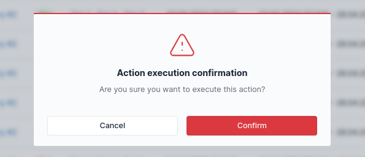

# Row actions

Row actions are actions in the context of the specific row.

## Adding row actions

To add row action, use data table builder's `addRowAction()` method:

```php #15-21 src/DataTable/Type/ProductDataTableType.php
use Kreyu\Bundle\DataTableBundle\DataTableBuilderInterface;
use Kreyu\Bundle\DataTableBundle\Type\AbstractDataTableType;
use Kreyu\Bundle\DataTableBundle\Action\Type\ButtonActionType;
use Symfony\Component\Routing\Generator\UrlGeneratorInterface;

class ProductDataTableType extends AbstractDataTableType
{
    public function __construct(
        private UrlGeneratorInterface $urlGenerator,
    ) {
    }
    
    public function buildDataTable(DataTableBuilderInterface $builder, array $options): void
    {
        $builder->addRowAction('update', ButtonActionType::class, [
            'href' => function (Product $product) {
                return $this->urlGenerator->generate('app_product_update', [
                    'id' => $product->getId(),
                ]);
            },
        ]);
    }
}
```

The same method can also be used on already created data tables:

```php #20-26 src/Controller/ProductController.php
use App\DataTable\Type\ProductDataTableType;
use Kreyu\Bundle\DataTableBundle\DataTableFactoryAwareTrait;
use Symfony\Bundle\FrameworkBundle\Controller\AbstractController;
use Symfony\Component\HttpFoundation\Request;
use Symfony\Component\Routing\Generator\UrlGeneratorInterface;

class ProductController extends AbstractController
{
    use DataTableFactoryAwareTrait;
    
    public function __construct(
        private UrlGeneratorInterface $urlGenerator,
    ) {
    }

    public function index(Request $request)
    {
        $dataTable = $this->createDataTable(ProductDataTableType::class);
        
        $dataTable->addRowAction('update', ButtonActionType::class, [
            'href' => function (Product $product) {
                return $this->urlGenerator->generate('app_product_update', [
                    'id' => $product->getId(),
                ]);
            },
        ]);
    }
}
```

This method accepts _three_ arguments:

- action name;
- action type — with a fully qualified class name;
- action options — defined by the action type, used to configure the action;

For reference, see [built-in action types](../../reference/actions/types.md).

## Adding actions column

Row actions require a [ActionsColumnType](../../reference/columns/types/actions.md), 
which simply renders given actions to the user.  To help with that process,
if at least one row action is defined, this actions column will be added automatically.

This column will be named `__actions`, which can be referenced using the constant:

```php
use Kreyu\Bundle\DataTableBundle\DataTableBuilderInterface;

$column = $builder->getColumn(DataTableBuilderInterface::ACTIONS_COLUMN_NAME);
```

This behavior can be disabled (or enabled back again) using the builder's method:

```php
$builder->setAutoAddingActionsColumn(false);
```

## Removing row actions

To remove existing row action, use the builder's `removeRowAction()` method:

```php #14 src/DataTable/Type/ProductDataTableType.php
use Kreyu\Bundle\DataTableBundle\DataTableBuilderInterface;
use Kreyu\Bundle\DataTableBundle\Type\AbstractDataTableType;
use Symfony\Component\Routing\Generator\UrlGeneratorInterface;

class ProductDataTableType extends AbstractDataTableType
{
    public function __construct(
        private UrlGeneratorInterface $urlGenerator,
    ) {
    }
    
    public function buildDataTable(DataTableBuilderInterface $builder, array $options): void
    {
        $builder->removeRowAction('update');
    }
}
```

The same method can also be used on already created data tables:

```php #14 src/Controller/ProductController.php
use App\DataTable\Type\ProductDataTableType;
use Kreyu\Bundle\DataTableBundle\DataTableFactoryAwareTrait;
use Symfony\Bundle\FrameworkBundle\Controller\AbstractController;
use Symfony\Component\HttpFoundation\Request;

class ProductController extends AbstractController
{
    use DataTableFactoryAwareTrait;
    
    public function index(Request $request)
    {
        $dataTable = $this->createDataTable(ProductDataTableType::class);
        
        $dataTable->removeRowAction('update');
    }
}
```

Any attempt of removing the non-existent row action will silently fail.

## Retrieving row actions

To retrieve already defined row actions, use the builder's `getRowActions()` or `getRowAction()` method:

```php # src/DataTable/Type/ProductDataTableType.php
use Kreyu\Bundle\DataTableBundle\DataTableBuilderInterface;
use Kreyu\Bundle\DataTableBundle\Type\AbstractDataTableType;

class ProductDataTableType extends AbstractDataTableType
{
    public function buildDataTable(DataTableBuilderInterface $builder, array $options): void
    {
        // retrieve all previously defined row actions:
        $actions = $builder->getRowActions();
        
        // or specific row action:
        $action = $builder->getRowAction('update');
        
        // or simply check whether the row action is defined:
        if ($builder->hasRowAction('update')) {
            // ...
        }
    }
}
```

The same methods are accessible on already created data tables:

```php # src/Controller/ProductController.php
use App\DataTable\Type\ProductDataTableType;
use Kreyu\Bundle\DataTableBundle\DataTableFactoryAwareTrait;
use Symfony\Bundle\FrameworkBundle\Controller\AbstractController;
use Symfony\Component\HttpFoundation\Request;

class ProductController extends AbstractController
{
    use DataTableFactoryAwareTrait;
    
    public function index(Request $request)
    {
        $dataTable = $this->createDataTable(ProductDataTableType::class);
        
        // retrieve all previously defined row actions:
        $actions = $dataTable->getRowActions();
        
        // or specific row action:
        $action = $dataTable->getRowAction('create');
        
        // or simply check whether the row action is defined:
        if ($dataTable->hasRowAction('create')) {
            // ...
        }
    }
}
```

!!!warning Warning
Any attempt of retrieving a non-existent action will result in an `OutOfBoundsException`.  
To check whether the row action of given name exists, use the `hasRowAction()` method.
!!!

!!!danger Important
Within the data table builder, the actions are still in their build state!
Therefore, actions retrieved by the methods:

- `DataTableBuilderInterface::getRowActions()`
- `DataTableBuilderInterface::getRowAction(string $name)`

...are instance of `ActionBuilderInterface`, whereas methods:

- `DataTableInterface::getRowActions()`
- `DataTableInterface::getRowAction(string $name)`

...return instances of `ActionInterface` instead.
!!!

## Adding action confirmation

Actions can be configured to require confirmation (by the user) before being executed.



To enable confirmation in the quickest way, set the action's `confirmation` option to `true`:

```php #10 src/DataTable/Type/ProductDataTableType.php
use Kreyu\Bundle\DataTableBundle\DataTableBuilderInterface;
use Kreyu\Bundle\DataTableBundle\Type\AbstractDataTableType;
use Kreyu\Bundle\DataTableBundle\Action\Type\ButtonActionType;

class ProductDataTableType extends AbstractDataTableType
{
    public function buildDataTable(DataTableBuilderInterface $builder, array $options): void
    {
        $builder->addRowAction('create', ButtonActionType::class, [
            'confirmation' => true,
        ]);
    }
}
```

To configure the confirmation modal, pass the array as the `confirmation` option:

```php #10-17 src/DataTable/Type/ProductDataTableType.php
use Kreyu\Bundle\DataTableBundle\DataTableBuilderInterface;
use Kreyu\Bundle\DataTableBundle\Type\AbstractDataTableType;
use Kreyu\Bundle\DataTableBundle\Action\Type\ButtonActionType;

class ProductDataTableType extends AbstractDataTableType
{
    public function buildDataTable(DataTableBuilderInterface $builder, array $options): void
    {
        $builder->addRowAction('create', ButtonActionType::class, [
            'confirmation' => [
                'translation_domain' => 'KreyuDataTable',
                'label_title' => 'Action confirmation',
                'label_description' => 'Are you sure you want to execute this action?',
                'label_confirm' => 'Confirm',
                'label_cancel' => 'Cancel',
                'type' => 'danger', // "danger", "warning" or "info"
            ],
        ]);
    }
}
```

For reference, see [action's `confirmation` option documentation](../../reference/actions/types/action/#confirmation).