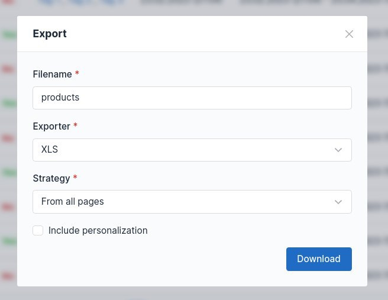

# Exporting

The data tables can be _exported_, with use of the [exporters](../reference/exporters/types.md).



## Toggling the feature

By default, the exporting feature is **enabled** for every data table.
This can be configured with the `exporting_enabled` option:

+++ Globally (YAML)
```yaml # config/packages/kreyu_data_table.yaml
kreyu_data_table:
  defaults:
    exporting:
      enabled: true
```
+++ Globally (PHP)
```php # config/packages/kreyu_data_table.php
use Symfony\Config\KreyuDataTableConfig;

return static function (KreyuDataTableConfig $config) {
    $defaults = $config->defaults();
    $defaults->exporting()->enabled(true);
};
```
+++ For data table type
```php # src/DataTable/Type/ProductDataTable.php
use Kreyu\Bundle\DataTableBundle\Type\AbstractDataTableType;
use Symfony\Component\OptionsResolver\OptionsResolver;

class ProductDataTableType extends AbstractDataTableType
{
    public function configureOptions(OptionsResolver $resolver): void
    {
        $resolver->setDefaults([
            'exporting_enabled' => true,
        ]);
    }
}
```
+++ For specific data table
```php # src/Controller/ProductController.php
use App\DataTable\Type\ProductDataTableType;
use Kreyu\Bundle\DataTableBundle\DataTableFactoryAwareTrait;
use Symfony\Bundle\FrameworkBundle\Controller\AbstractController;

class ProductController extends AbstractController
{
    use DataTableFactoryAwareTrait;
    
    public function index()
    {
        $dataTable = $this->createDataTable(
            type: ProductDataTableType::class, 
            query: $query,
            options: [
                'exporting_enabled' => true,
            ],
        );
    }
}
```
+++

!!! Enabling the feature does not mean that any column will be exportable by itself.
By default, columns **are not** exportable.
!!!

### Making the columns exportable

To make any column exportable, use its `export` option:

```php # src/DataTable/Type/ProductDataTableType.php
use Kreyu\Bundle\DataTableBundle\DataTableBuilderInterface;
use Kreyu\Bundle\DataTableBundle\Column\Type\NumberColumnType;
use Kreyu\Bundle\DataTableBundle\Type\AbstractDataTableType;

class ProductDataTableType extends AbstractDataTableType
{
    public function buildDataTable(DataTableBuilderInterface $builder, array $options): void
    {
        $builder
            ->addColumn('id', NumberColumnType::class, [
                'export' => true,
            ])
        ;
    }
}
```

The column can be configured separately for the export by providing the array in the `export` option.
For example, to change the label of the column in the export:

```php # src/DataTable/Type/ProductDataTableType.php
use Kreyu\Bundle\DataTableBundle\DataTableBuilderInterface;
use Kreyu\Bundle\DataTableBundle\Column\Type\TextColumnType;
use Kreyu\Bundle\DataTableBundle\Type\AbstractDataTableType;

class ProductDataTableType extends AbstractDataTableType
{
    public function buildDataTable(DataTableBuilderInterface $builder, array $options): void
    {
        $builder
            ->addColumn('category', TextColumnType::class, [
                'export' => [
                    'label' => 'Category Name',
                ],
            ])
        ;
    }
}
```

## Adding the exporters

To add exporter, use the builder's `addExporter()` method on the data table builder:

```php # src/DataTable/Type/ProductDataTableType.php
use Kreyu\Bundle\DataTableBundle\DataTableBuilderInterface;
use Kreyu\Bundle\DataTableBundle\Type\AbstractDataTableType;
use Kreyu\Bundle\DataTableOpenSpoutBundle\Exporter\Type\CsvExporterType;
use Kreyu\Bundle\DataTableOpenSpoutBundle\Exporter\Type\XlsxExporterType;

class ProductDataTableType extends AbstractDataTableType
{
    public function buildDataTable(DataTableBuilderInterface $builder, array $options): void
    {
        $builder
            ->addExporter('csv', CsvExporterType::class)
            ->addExporter('xlsx', XlsxExporterType::class)
        ;
    }
}
```

The builder's `addExporter()` method accepts _three_ arguments:

- exporter name;
- exporter type — with a fully qualified class name;
- exporter options — defined by the exporter type, used to configure the exporter;

For reference, see [built-in exporter types](../reference/exporters/types.md).

## Configuring default export data

The default export data, such as filename, exporter, strategy and a flag to include personalization,
can be configured using the data table builder's `setDefaultExportData()` method:

```php # src/DataTable/Type/ProductDataTableType.php
use Kreyu\Bundle\DataTableBundle\DataTableBuilderInterface;
use Kreyu\Bundle\DataTableBundle\Exporter\ExportData;
use Kreyu\Bundle\DataTableBundle\Type\AbstractDataTableType;

class ProductDataTableType extends AbstractDataTableType
{
    public function buildDataTable(DataTableBuilderInterface $builder, array $options): void
    {
        $builder
            ->setDefaultExportData(ExportData::fromArray([
                'filename' => sprintf('products_%s', date('Y-m-d')),
                'exporter' => 'xlsx',
                'strategy' => ExportStrategy::IncludeAll,
                'include_personalization' => true,
            ]))
        ;
    }
}
```

## Handling the export form

In the controller, use the `isExporting()` method to make sure the request should be handled as an export:

```php #15-17 src/Controller/ProductController.php
use App\DataTable\Type\ProductDataTableType;
use Kreyu\Bundle\DataTableBundle\DataTableFactoryAwareTrait;
use Symfony\Bundle\FrameworkBundle\Controller\AbstractController;
use Symfony\Component\HttpFoundation\Request;

class ProductController extends AbstractController
{
    use DataTableFactoryAwareTrait;

    public function index(Request $request)
    {
        $dataTable = $this->createDataTable(ProductDataTableType::class);
        $dataTable->handleRequest($request);

        if ($dataTable->isExporting()) {
            return $this->file($dataTable->export());
        }
    }
}
```

## Exporting without user input

To export the data table manually, without user input, use the `export()` method directly: 

```php #13-14 src/Controller/ProductController.php
use App\DataTable\Type\ProductDataTableType;
use Kreyu\Bundle\DataTableBundle\DataTableFactoryAwareTrait;
use Symfony\Bundle\FrameworkBundle\Controller\AbstractController;

class ProductController extends AbstractController
{
    use DataTableFactoryAwareTrait;

    public function index()
    {
        $dataTable = $this->createDataTable(ProductDataTableType::class);

        // An instance of ExportFile, which extends the HttpFoundation File object
        $file = $dataTable->export();
        
        // For example, save it manually:
        $file->move(__DIR__);
        
        // Or return a BinaryFileResponse to download it in browser:   
        return $this->file($file);
    }
}
```

The export data such as filename, exporter, strategy and a flag to include personalization,
can be included by passing it directly to the `export()` method:

```php #13-14,16 src/Controller/ProductController.php
use App\DataTable\Type\ProductDataTableType;
use Kreyu\Bundle\DataTableBundle\DataTableFactoryAwareTrait;
use Symfony\Bundle\FrameworkBundle\Controller\AbstractController;

class ProductController extends AbstractController
{
    use DataTableFactoryAwareTrait;

    public function index()
    {
        $dataTable = $this->createDataTable(ProductDataTableType::class);

        $exportData = ExportData::fromDataTable($dataTable);
        $exportData->filename = sprintf('products_%s', date('Y-m-d'));
        $exportData->includePersonalization = false;
        
        $file = $dataTable->export($exportData);
        
        // ...
    }
}
```

## Exporting optimization

The exporting process including all pages of the large datasets can take a very long time. 
To optimize this process, when using Doctrine ORM, change the hydration mode to array during the export:

```php # src/DataTable/Type/ProductDataTableType.php
use Doctrine\ORM\AbstractQuery;
use Kreyu\Bundle\DataTableBundle\DataTableBuilderInterface;
use Kreyu\Bundle\DataTableBundle\Event\DataTableEvent;
use Kreyu\Bundle\DataTableBundle\Event\DataTableEvents;
use Kreyu\Bundle\DataTableBundle\Type\AbstractDataTableType;

class ProductDataTableType extends AbstractDataTableType
{
    public function buildDataTable(DataTableBuilderInterface $builder, array $options): void
    {
        $builder->addEventListener(DataTableEvents::PRE_EXPORT, function (DataTableEvent $event) {
            $event->getDataTable()->getQuery()->setHydrationMode(AbstractQuery::HYDRATE_ARRAY);
        });
    }
}
```

This will prevent the Doctrine ORM from hydrating the entities, which is not needed for the export.
Unfortunately, this means each exportable column property path has to be changed to array (wrapped in square brackets):

```php # src/DataTable/Type/ProductDataTableType.php
use Kreyu\Bundle\DataTableBundle\DataTableBuilderInterface;
use Kreyu\Bundle\DataTableBundle\Column\Type\NumberColumnType;
use Kreyu\Bundle\DataTableBundle\Type\AbstractDataTableType;

class ProductDataTableType extends AbstractDataTableType
{
    public function buildDataTable(DataTableBuilderInterface $builder, array $options): void
    {
        $builder
            ->addColumn('id', NumberColumnType::class, [
                'export' => [
                    'property_path' => '[id]',
                ],
            ])
        ;
    }
}

```

## Events

Following events are dispatched when [:icon-mark-github: DataTableInterface::export()](https://github.com/Kreyu/data-table-bundle/blob/main/src/DataTableInterface.php) is called:

[:icon-mark-github: DataTableEvents::PRE_EXPORT](https://github.com/Kreyu/data-table-bundle/blob/main/src/Event/DataTableEvents.php)
:   Dispatched before the exporter is called.
    Can be used to modify the exporting data, e.g. to force an export strategy or change the filename.

The listeners and subscribers will receive an instance of the [:icon-mark-github: DataTableExportEvent](https://github.com/Kreyu/data-table-bundle/blob/main/src/Event/DataTableExportEvent.php):

```php
use Kreyu\Bundle\DataTableBundle\Event\DataTableExportEvent;

class DataTableExportListener
{
    public function __invoke(DataTableExportEvent $event): void
    {
        $dataTable = $event->getDataTable();
        $exportData = $event->getExportData();
        
        // for example, modify the export data, then save it in the event
        $event->setExportData($exportData); 
    }
}
```