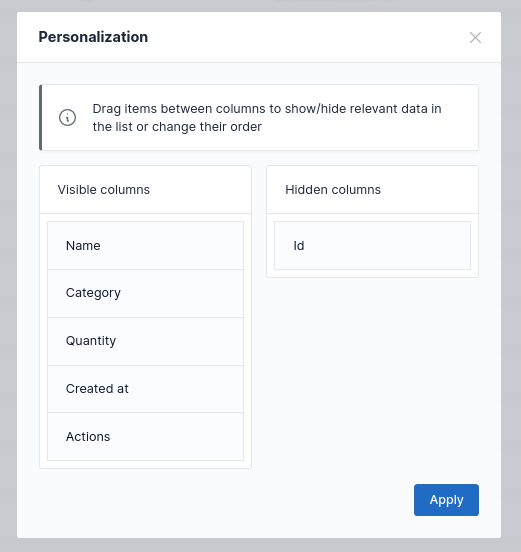

# Personalization

--

The data tables can be _personalized_, which can be helpful when working with many columns, by giving the user ability to:

- set the order of the columns;
- show or hide specific columns;

### Prerequisites

To begin with, make sure the [Symfony UX integration is enabled](../installation.md#enable-the-symfony-ux-integration).
Then, enable the **personalization** controller:

:::flex
```json # assets/controllers.json
{
    "controllers": {
        "@kreyu/data-table-bundle": {
            "personalization": {
                "enabled": true
            }
        }
    }
}
```
:::

### Toggling the feature

By default, the personalization feature is **disabled** for every data table.

You can change this setting globally using the package configuration file, or use `personalization_enabled` option:

+++ Globally (YAML)
```yaml # config/packages/kreyu_data_table.yaml
kreyu_data_table:
  defaults:
    personalization:
      enabled: true
```
+++ Globally (PHP)
```php # config/packages/kreyu_data_table.php
use Symfony\Config\KreyuDataTableConfig;

return static function (KreyuDataTableConfig $config) {
    $defaults = $config->defaults();
    $defaults->personalization()->enabled(true);
};
```
+++ For data table type
```php # src/DataTable/Type/ProductDataTable.php
use Kreyu\Bundle\DataTableBundle\Type\AbstractDataTableType;
use Symfony\Component\OptionsResolver\OptionsResolver;

class ProductDataTableType extends AbstractDataTableType
{
    public function configureOptions(OptionsResolver $resolver): void
    {
        $resolver->setDefaults([
            'personalization_enabled' => true,
        ]);
    }
}
```
+++ For specific data table
```php # src/Controller/ProductController.php
use App\DataTable\Type\ProductDataTableType;
use Kreyu\Bundle\DataTableBundle\DataTableFactoryAwareTrait;
use Symfony\Bundle\FrameworkBundle\Controller\AbstractController;

class ProductController extends AbstractController
{
    use DataTableFactoryAwareTrait;
    
    public function index()
    {
        $dataTable = $this->createDataTable(
            type: ProductDataTableType::class, 
            query: $query,
            options: [
                'personalization_enabled' => true,
            ],
        );
    }
}
```
+++

### Configuring the feature persistence

By default, the personalization feature [persistence](persistence.md) is **disabled** for every data table.

You can configure the [persistence](persistence.md) globally using the package configuration file, or its related options:

+++ Globally (YAML)
```yaml # config/packages/kreyu_data_table.yaml
kreyu_data_table:
  defaults:
    personalization:
      persistence_enabled: true
      # if persistence is enabled and symfony/cache is installed, null otherwise
      persistence_adapter: kreyu_data_table.sorting.persistence.adapter.cache
      # if persistence is enabled and symfony/security-bundle is installed, null otherwise
      persistence_subject_provider: kreyu_data_table.persistence.subject_provider.token_storage
```
+++ Globally (PHP)
```php # config/packages/kreyu_data_table.php
use Symfony\Config\KreyuDataTableConfig;

return static function (KreyuDataTableConfig $config) {
    $defaults = $config->defaults();
    $defaults->personalization()
        ->persistenceEnabled(true)
        // if persistence is enabled and symfony/cache is installed, null otherwise
        ->persistenceAdapter('kreyu_data_table.sorting.persistence.adapter.cache')
        // if persistence is enabled and symfony/security-bundle is installed, null otherwise
        ->persistenceSubjectProvider('kreyu_data_table.persistence.subject_provider.token_storage')
    ;
};
```
+++ For data table type
```php # src/DataTable/Type/ProductDataTable.php
use Kreyu\Bundle\DataTableBundle\Persistence\PersistenceAdapterInterface;
use Kreyu\Bundle\DataTableBundle\Persistence\PersistenceSubjectProviderInterface;
use Kreyu\Bundle\DataTableBundle\Type\AbstractDataTableType;
use Symfony\Component\OptionsResolver\OptionsResolver;

class ProductDataTableType extends AbstractDataTableType
{
    public function __construct(
        private PersistenceAdapterInterface $persistenceAdapter,
        private PersistenceSubjectProviderInterface $persistenceSubjectProvider,
    ) {
    }

    public function configureOptions(OptionsResolver $resolver): void
    {
        $resolver->setDefaults([
            'personalization_persistence_enabled' => true,
            'personalization_persistence_adapter' => $this->persistenceAdapter,
            'personalization_persistence_subject' => $this->persistenceSubjectProvider->provide(),
        ]);
    }
}
```
+++ For specific data table
```php # src/Controller/ProductController.php
use App\DataTable\Type\ProductDataTableType;
use Kreyu\Bundle\DataTableBundle\DataTableFactoryAwareTrait;
use Kreyu\Bundle\DataTableBundle\Persistence\PersistenceAdapterInterface;
use Kreyu\Bundle\DataTableBundle\Persistence\PersistenceSubjectProviderInterface;
use Symfony\Bundle\FrameworkBundle\Controller\AbstractController;

class ProductController extends AbstractController
{
    use DataTableFactoryAwareTrait;
    
    public function __construct(
        private PersistenceAdapterInterface $persistenceAdapter,
        private PersistenceSubjectProviderInterface $persistenceSubjectProvider,
    ) {
    }
    
    public function index()
    {
        $dataTable = $this->createDataTable(
            type: ProductDataTableType::class, 
            query: $query,
            options: [
                'personalization_persistence_enabled' => true,
                'personalization_persistence_adapter' => $this->persistenceAdapter,
                'personalization_persistence_subject' => $this->persistenceSubjectProvider->provide(),
            ],
        );
    }
}
```
+++

## Configuring default pagination

The default personalization data can be overridden using the data table builder's `setDefaultPersonalizationData()` method:

```php # src/DataTable/Type/ProductDataTableType.php
use Kreyu\Bundle\DataTableBundle\DataTableBuilderInterface;
use Kreyu\Bundle\DataTableBundle\Type\AbstractDataTableType;
use Kreyu\Bundle\DataTableBundle\Personalization\PersonalizationData;
use Kreyu\Bundle\DataTableBundle\Personalization\PersonalizationColumnData;

class ProductDataTableType extends AbstractDataTableType
{
    public function buildDataTable(DataTableBuilderInterface $builder, array $options): void
    {
        $builder->setDefaultPersonalizationData(new PersonalizationData([
            new PersonalizationColumnData(name: 'id', order: 0, visible: false),
            new PersonalizationColumnData(name: 'name', order: 1, visible: true),
        ]));
        
        // or by creating the personalization data from an array:
        $builder->setDefaultPersonalizationData(PersonalizationData::fromArray([
            // each entry default values: name = from key, order = 0, visible = false
            'id' => ['visible' => false],
            'name' => ['order' => 1, 'visible' => true],
        ]));
    }
}
```
